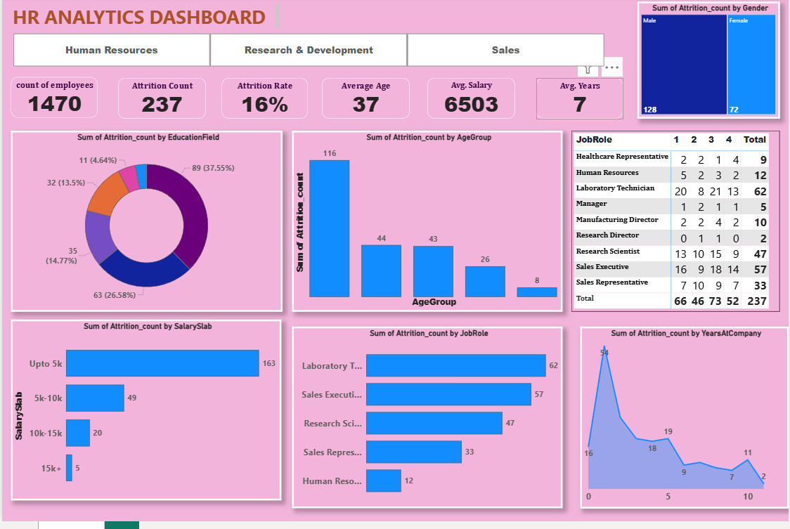

# HR Analytics Power BI Dashboard

## Project Overview

This project presents an interactive HR Analytics dashboard built using **Power BI**. The dashboard aims to provide insights into employee attrition within an organization by analyzing various dimensions such as job role, age group, gender, salary slabs, and years at the company.

## Files Included

- `HR_Analytics.xlsx` - Source dataset used for the analysis.
- `HR_analytics_Power_Bi.pbix` - Power BI file containing the visuals and dashboard.

## Key Insights from the Dashboard

- **Total Employees:** 1,470  
- **Attrition Count:** 237  
- **Attrition Rate:** 16%  
- **Average Age:** 37  
- **Average Salary:** $6,503  
- **Average Years at Company:** 7  

### Attrition by Category

- **By Gender:** Higher attrition in **Males (128)** compared to **Females (72)**.
- **By Age Group:** Majority of attrition occurs in the **youngest age group**.
- **By Salary Slab:** 
  - 68% (163 out of 237) attrition cases are from employees earning **up to $5,000**.
- **By Job Role:**
  - **Laboratory Technicians, Sales Executives, and Research Scientists** have the highest attrition.
- **By Years at Company:**
  - Highest attrition happens during the **first year** of employment.
- **By Education Field:**
  - Certain fields like **Life Sciences** have relatively higher attrition.

## Tools Used

- Power BI Desktop
- Microsoft Excel

## Dashboard Preview

## How to Use

1. Download the `.pbix` file.
2. Open it using Power BI Desktop.
3. Explore the different filters, slicers, and visuals for detailed analysis.

## Contact

Created by [Aman-Ptl](https://github.com/Aman-Ptl)  
Feel free to connect for collaboration or questions!

